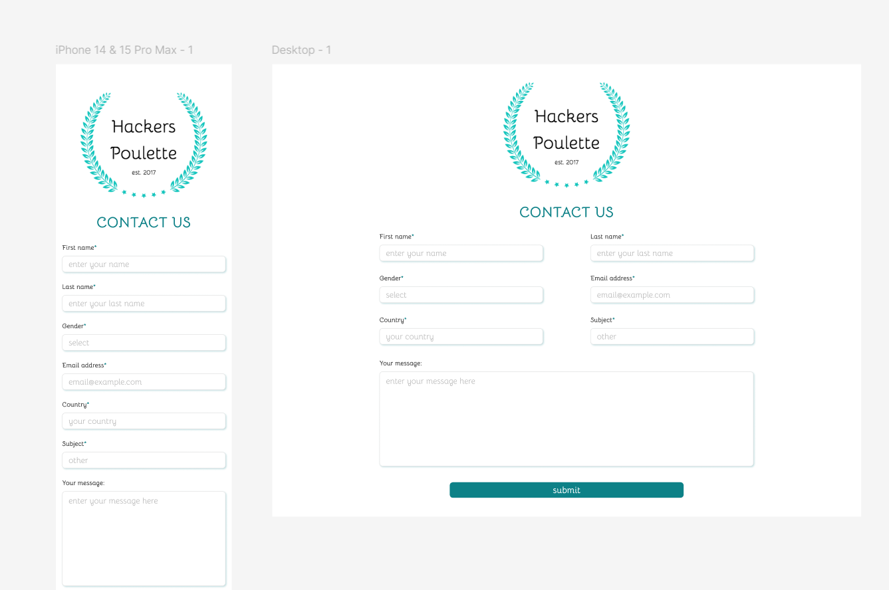

# Hackers Poulette 
Welcome to Hackers Poulette, a simple contact form project. 
## Introduction Hackers Poulette is a project aimed at creating a functional contact form. It allows users to send messages to a predefined email address. 
## Features 
- Simple user interface. 
- Form validation to ensure all required fields are filled out. 
- Sending email notifications upon successful submission of the contact form. 
- Displaying error messages if the form submission fails or if any required fields are missing. 
 ## Preview  
 ## Dependencies This project relies on the following dependencies: - [PHPMailer](https://github.com/PHPMailer/PHPMailer) - For sending emails from PHP.
